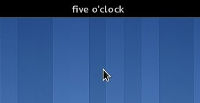

# Fuzzy Clock for Gnome Shell

A human-readable clock for the gnome-shell panel.



Currently tested on Gnome 3.34 only.
Translated to English, Italian, German, French and Esperanto (read below if you want to contribute a translation).

## Install

This extension can be installed from [the official Gnome Extensions website](https://extensions.gnome.org/extension/202/fuzzy-clock/).

## Develop

Some npm commands are available to make development on this extension easier.

* `npm run test` to run the test suite;
* `npm run lint` and `npm run lint:fix` to run the linter (with optional auto-fixing of errors);
* `npm run pack` to create the extension bundle;
* `npm run install` to install the extension locally (nb: requires a restart of the shell, which can be done via `Alt+F2`, command `r`);
* `npm run logs` to tail the logs of the Gnome shell, useful in case of errors.

## How to contribute Translations

New translations are very welcome!
If you want to contribute a translation, generate a `.po` file with the translated strings.
You can start from an existing one (e.g., `po/it.po`) as a blueprint.

### Some things to watch out for:

`%0` refers to the *current* hour (should therefore be used in strings like `Five past %0`).

`%1` refers to the *next* hour (use it in `Quarter to %1`, for example.)

Once you are done translating, generate the machine-readable `.mo` file.
To do so on a Linux system, you'll need to the following:

 - Install the `gettext` package (Use your distro's package manager, this here is for Ubuntu):

 ```
 $ sudo apt install gettext
 ```

 - Generate the file by running

 ```
 $ msgfmt inputfile.po -o fuzzyclock.mo
 ```

 - Replace `inputfile.po` accordingly, of course.

 - Place the `fuzzyclock.mo` file in the `locale/LANG/LC_MESSAGES/` subdirectory, where `LANG` is the Language abbreviation for your translation (e. g. fr, de, en, it).

 - Create a PR with your proposed changes.